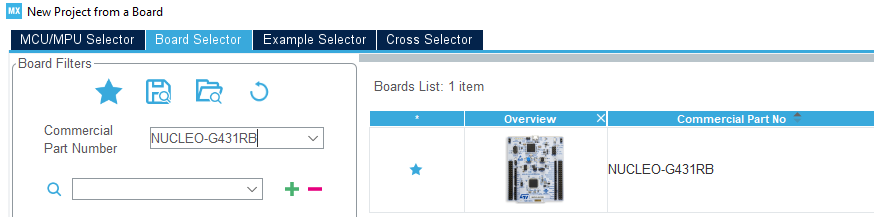
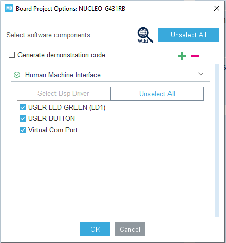
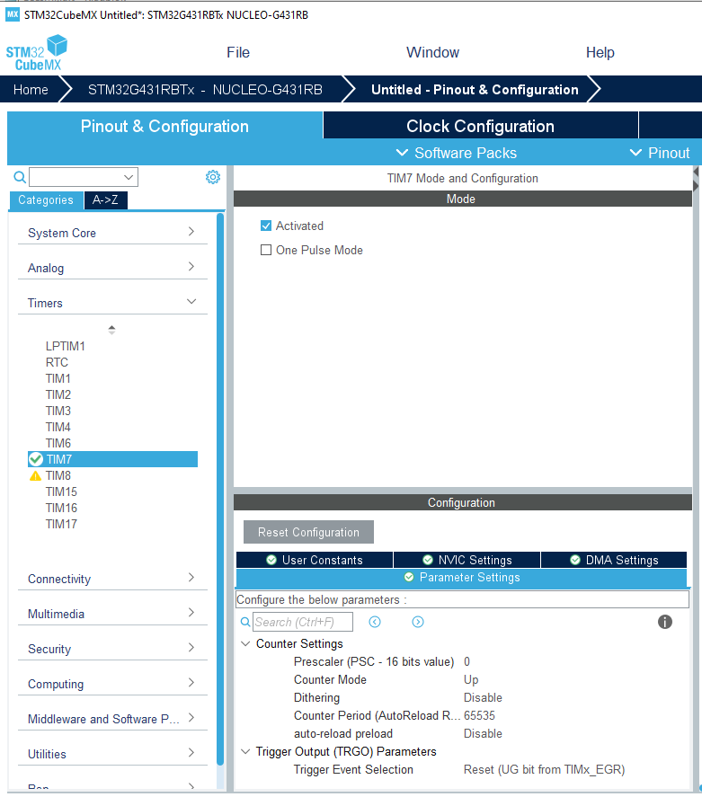
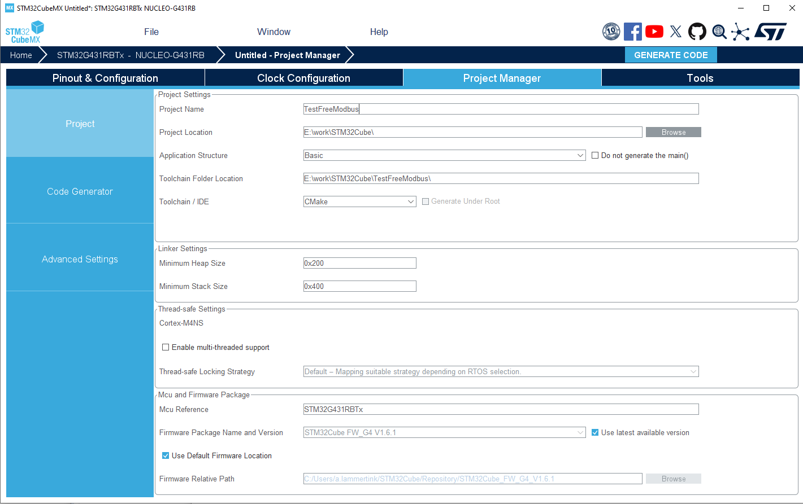

# FreeModbus STM32 Port for CMake Projects

This directory contains a generic port of the FreeModbus library for STM32 microcontrollers. The port is designed to be easily adaptable to different STM32 families while maintaining compatibility with STM32CubeMX-generated projects.

## Development Environment

This project uses **Visual Studio Code** with the [STM32 VS Code Extension](https://marketplace.visualstudio.com/items?itemName=stmicroelectronics.stm32-vscode-extension) as the primary development environment. STM32CubeIDE is not used.

### Required Tools

- **Visual Studio Code**
- **STM32 VS Code Extension**
- **STM32CubeMX** (for project generation)
- **ARM GCC Toolchain**
- **CMake**
- **Ninja** (optional, for faster builds)
- **Git** (for cloning the repository)

## Directory Structure

```
STM32_CMAKE/
├── demo.c                     # Simple demo application showing register usage
├── GenerateCmakeProject.png   # Screenshot of CubeMX project configuration
├── SelectBoard.png            # Screenshot of board selection
├── ActivateTIM7.png           # Screenshot of TIM7 activation
├── ProjectSettings.png        # Screenshot of project settings
├── CMakeLists.txt             # Example CMakeLists.txt for integration
├── .vscode/                   # VSCode configuration files for STM32 development
│   ├── c_cpp_properties.json  # C/C++ configuration
│   ├── launch.json            # Debug configuration
│   ├── settings.json          # VSCode settings
│   └── tasks.json             # Build tasks
├── port/                      # Port-specific code
│   ├── portevent.c            # Event handling for Modbus
│   ├── portserial.c           # UART/serial communication
│   ├── porttimer.c            # Timer implementations
│   ├── portcritical.c         # Critical section management
│   ├── port.h                 # Main port configuration
│   └── port_internal.h        # Internal port config (processor specific)
```

## Getting Started with STM32 Nucleo Boards

This port has been tested with the NUCLEO-G431RB board and should work on a wide range of STM32 Nucleo boards with minimal modifications.

### 1. Create a New STM32CubeMX Project

1. **Launch STM32CubeMX** and select "Start My project from ST Board"
   
   

2. **Select your Nucleo board** (e.g., NUCLEO-G431RB)
   - Double-click on the board picture
   - Wait until "Board Options" appears
   - Leave these at the default values
     

3. **Configure Peripherals**
   - Activate **Timer 7** (TIM7)
     
   - The virtual COM port (LPUART1 or USART2) should already be enabled by default through the BSP package (and cannot be changed).

4. **Open Project Manager Tab**
   - Enter your project name
   - Select "Basic" for Application Structure
   - Select "CMake" for Toolchain/IDE
     

5. **Generate Code**
   - Click "Generate Code" button to create the project files

### 2. Integrate FreeModbus Library

You have two options for integrating the FreeModbus library into your project:

#### Option A: Clone the Repository

The simplest approach is to clone the FreeModbus repository directly:

```bash
# Clone the FreeModbus repository
git clone https://github.com/alammertink/freemodbus.git

# Copy the .vscode directory from FreeModbus into your project
cp -r freemodbus/demo/STM32_CMAKE/.vscode ./

# Copy the example CMakeLists.txt (optional, you can also modify your existing one)
cp freemodbus/demo/STM32_CMAKE/CMakeLists.txt .
```

#### Option B: Use Git Submodules

If you're using Git for version control in your project, you can add FreeModbus as a submodule:

```bash
# Initialize git repository (if not already done)
git init

# Add FreeModbus as a Git submodule
git submodule add https://github.com/alammertink/freemodbus.git

# Copy the .vscode directory from FreeModbus into your project
cp -r freemodbus/demo/STM32_CMAKE/.vscode ./

# Copy the example CMakeLists.txt (optional, you can also modify your existing one)
cp freemodbus/demo/STM32_CMAKE/CMakeLists.txt .
```

#### CMake Integration

If you're using your own CMakeLists.txt, make sure to add the following:

```cmake
# Add FreeModbus library
add_subdirectory(${CMAKE_SOURCE_DIR}/freemodbus ${CMAKE_BINARY_DIR}/freemodbus)

# Add sources to executable
target_sources(${CMAKE_PROJECT_NAME} PRIVATE
    # ...existing sources...
    ${FREEMODBUS_APP_SOURCES} # Platform-dependent sources from FreeModbus
    ${CMAKE_SOURCE_DIR}/freemodbus/demo/STM32_CMAKE/demo.c
)

# Add FreeModbus include directories
target_include_directories(${CMAKE_PROJECT_NAME} PRIVATE
    # ...existing include paths...
    ${FREEMODBUS_INCLUDE_DIRS}
)

# Link against FreeModbus library
target_link_libraries(${CMAKE_PROJECT_NAME} PRIVATE
    # ...existing libraries...
    freemodbus
)
```

### 3. Configure and Build in Visual Studio Code

1. **Open the project folder in VS Code**

2. **Configure the project**
   - Press `Ctrl+Shift+P` to open the command palette
   - Type `CMake: Configure` and press Enter
   - Select "Debug" configuration

3. **Build the project**
   - Press `Ctrl+Shift+P` to open the command palette
   - Type `STM32: Build` and press Enter

4. **Flash the device**
   - Press `Ctrl+Shift+P` to open the command palette
   - Type `STM32: Download` and press Enter

## Compatibility Notes

This port was designed with wide compatibility in mind:

1. **Virtual COM Port** - All STM32 Nucleo boards have a virtual COM port connected to the ST-LINK, which this demo uses for Modbus communication.

2. **TIM7 Support** - TIM7 is available on many STM32 families including:
   - STM32F1 series
   - STM32F2/F3/F4/F7 series
   - STM32G0/G4 series
   - STM32H7 series
   - Most STM32L series (L0, L4, L5)
   - STM32WB series

3. **Board Support Package (BSP)** - The demo leverages the STM32 Nucleo BSP, which provides standardized interfaces for board components across different STM32 families.

## Custom Integration

If you need to customize the integration with your own application:

1. Don't include the demo.c file directly, but instead create your own application file.
2. Copy the relevant initialization code from demo.c, adapting it to your application.
3. Implement your own register callback functions as needed for your specific application.
4. Make sure to call `eMBPoll()` regularly in your main loop to handle Modbus requests.

## Demo Application

The `demo.c` file provides a simple example of how to initialize and use the FreeModbus library with STM32 microcontrollers. It implements:

- Basic initialization of the Modbus stack
- A callback function for register read/write operations
- A counter updating register values periodically
- Example of how to call the Modbus poll function from your main loop

The demo is meant to be used as a starting point and reference for your own implementation.

## Example Usage

```c
#include "mb.h"

// Define the Modbus slave address
#define MB_SLAVE_ADDR     1

// Define the Modbus register holdings
USHORT usRegHoldingBuf[4] = { 0 };

int main(void)
{
    // Initialize HAL and peripherals
    HAL_Init();
    SystemClock_Config();
    MX_GPIO_Init();
    
    // Initialize board LED for status indication
    BSP_LED_Init(LED2);
    
    // Initialize Modbus protocol stack
    eMBInit(MB_RTU, MB_SLAVE_ADDR, 0, 115200, MB_PAR_NONE);
    
    // Enable the Modbus protocol stack
    eMBEnable();
    
    while(1)
    {
        // Poll the Modbus state machine
        eMBPoll();
        
        // Update your application state here
        usRegHoldingBuf[0]++;
        
        // Visual indication of operation
        BSP_LED_Toggle(LED2);
        HAL_Delay(100);
    }
}
```

## Known Limitations

- UART baud rate changes require reinitialization of the Modbus stack.
- The current implementation only supports RTU mode (ASCII mode is not tested).
- The port uses TIM7 which may conflict with other timer-using peripherals.


### Additional Notes

- Ensure that the UART callbacks are properly registered after applying the fix.
- If you encounter issues with UART communication, verify that the `IsComMspCbValid` array is correctly indexed for your COM port.

## Testing the Demo

The Modbus RTU implementation can be tested with various Modbus master tools. One recommended option is modpoll, a command-line based Modbus master simulator.

### Testing with modpoll

[modpoll](https://www.modbusdriver.com/modpoll.html) is a free command-line based Modbus master simulator that can be used to test your Modbus slave implementation.

#### Example Test Command

The following example shows how to read input registers from the demo application using the ST-Link virtual COM port (in this case COM7):

```
$ ./modpoll.exe -m rtu -a 10 -r 1000 -c 4 -d 8 -t 3 -b 115200 -p none -s 1 COM7
modpoll 3.10 - FieldTalk(tm) Modbus(R) Master Simulator
Copyright (c) 2002-2021 proconX Pty Ltd
Visit https://www.modbusdriver.com for Modbus libraries and tools.

Protocol configuration: Modbus RTU, FC4
Slave configuration...: address = 10, start reference = 1000, count = 4
Communication.........: COM7, 115200, 8, 1, none, t/o 1.00 s, poll rate 1000 ms
Data type.............: 16-bit register, input register table

-- Polling slave... (Ctrl-C to stop)
[1000]: -26794
[1001]: 0
[1002]: 0
[1003]: 0
-- Polling slave... (Ctrl-C to stop)
[1000]: 1317
[1001]: 0
[1002]: 0
[1003]: 0
-- Polling slave... (Ctrl-C to stop)
[1000]: 27325
[1001]: 0
[1002]: 0
[1003]: 0
-- Polling slave... (Ctrl-C to stop)
[1000]: 30445
[1001]: 0
[1002]: 0
[1003]: 0
-- Polling slave... (Ctrl-C to stop)
```

#### modpoll Command Line Options

The command line parameters used in the example above are:

| Option | Description |
|--------|-------------|
| `-m rtu` | Use Modbus RTU protocol |
| `-a 10` | Set the slave address to 10 |
| `-r 1000` | Start reading at reference 1000 |
| `-c 4` | Read 4 registers |
| `-d 8` | Set data bits to 8 |
| `-t 3` | Set Modbus function code to 3 (read holding registers) |
| `-b 115200` | Set baud rate to 115200 |
| `-p none` | Set parity to none |
| `-s 1` | Set stop bits to 1 |
| `COM7` | COM port to use |

### Other Testing Tools

Other Modbus master software that can be used for testing:

- [Modbus Poll](https://www.modbustools.com/modbus_poll.html) - GUI-based commercial Modbus master simulator
- [QModMaster](https://github.com/QModbus/QModMaster) - Open-source Qt-based Modbus master
- [PyModbus](https://github.com/riptideio/pymodbus) - Python-based Modbus implementation

## License

This STM32 CMake port follows the multi-license structure of the original FreeModbus project:

- Port files (`port/*.c`, `port/*.h`): LGPL License
- Demo application (`demo.c`): GPL License

The LGPL license allows integration of the port files into proprietary software under certain conditions, while the GPL license for the demo application requires that any derivative work also be licensed under GPL.

For specific details, see the license headers in individual source files and refer to the full license texts in the root directory of the original FreeModbus repository.

## Additional Information

For more detailed information about the FreeModbus protocol implementation, refer to the official documentation in the root directory of the FreeModbus library.
